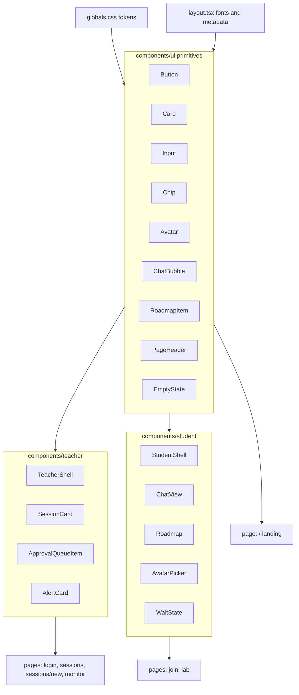

# GENIAUTAS UX/UI Revamp (full pass, hybrid styling)

## Objetivo

Transformar la app actual (tema claro, inline styles, fuentes Geist) en el laboratorio espacial guiado descrito en [GENIAUTAS-DESIGN.md](GENIAUTAS-DESIGN.md): tema oscuro `Mission Night`, fuentes Fredoka/DM Sans/Space Mono, tokens correctos, primitivos reutilizables y los dos Shells (Student / Teacher).

**Estilo**: tokens globales en `globals.css` + CSS Modules por componente. Sin Tailwind en JSX (se conserva instalado pero no se usa para clases sem\u00e1nticas).

**Funcionalidad**: NO se cambia l\u00f3gica de Supabase, servicios, realtime ni rutas. Solo presentaci\u00f3n.

---

## 1. Cimientos: tokens y tipograf\u00eda

### 1.1 Reescribir [geniautas-app/src/app/globals.css](geniautas-app/src/app/globals.css)

Reemplazar el contenido actual por el bloque `:root` del documento de dise\u00f1o (l\u00edneas 161\u2013245 de [GENIAUTAS-DESIGN.md](GENIAUTAS-DESIGN.md)):

- Paleta core (`--color-bg`, `--color-bg-elevated`, `--color-surface-1..3`, `--color-primary`, `--color-progress`, `--color-success`, `--color-warning`, `--color-danger`, `--color-info`, `--color-text*`, `--color-border*`, `--color-overlay`).
- Tokens de tipograf\u00eda (`--font-heading`, `--font-body`, `--font-mono`, escalas `--text-h1..--text-mono`, line-heights).
- Espaciado (`--sp-1..--sp-8`), radios (`--radius-sm..--radius-pill`), sombras y glows (`--shadow-*`, `--glow-*`), layout (`--container-student`, `--container-teacher`, `--panel-sidebar`, `--panel-aside`, `--chat-max-width`), transiciones (`--ease-standard`, `--transition-fast/base/slow`).
- Reset/base: `* { box-sizing: border-box; }`, `html, body { background: var(--color-bg); color: var(--color-text); font-family: var(--font-body); ... }`, foco accesible (`:focus-visible { box-shadow: var(--glow-primary-sm); border-radius: inherit; }`), scrollbar oscuro fino, tipograf\u00eda base para `h1\u2013h4` con `font-family: var(--font-heading)` y los tama\u00f1os correspondientes.

Eliminar las clases `.btn-primary`, `.input-base` y `.card` del archivo actual (se reemplazan por primitivos con CSS Modules).

### 1.2 Cargar fuentes en [geniautas-app/src/app/layout.tsx](geniautas-app/src/app/layout.tsx)

Reemplazar `Geist` y `Geist_Mono` por:

```tsx
import { Fredoka, DM_Sans, Space_Mono } from "next/font/google";

const fredoka = Fredoka({ subsets: ["latin"], variable: "--font-heading-loaded", weight: ["400","500","600","700"] });
const dmSans = DM_Sans({ subsets: ["latin"], variable: "--font-body-loaded", weight: ["400","500","600","700"] });
const spaceMono = Space_Mono({ subsets: ["latin"], variable: "--font-mono-loaded", weight: ["400","700"] });
```

En `globals.css`, sobrescribir:

```css
:root {
  --font-heading: var(--font-heading-loaded), 'Fredoka', system-ui, sans-serif;
  --font-body: var(--font-body-loaded), 'DM Sans', system-ui, sans-serif;
  --font-mono: var(--font-mono-loaded), 'Space Mono', ui-monospace, monospace;
}
```

Actualizar `metadata`: `title: "GENIAUTAS"`, `description: "Laboratorio guiado de IA en el aula"`.

---

## 2. Primitivos UI (`components/ui/`)

Cada primitivo: archivo `.tsx` + archivo `.module.css` co-localizado. Carpeta nueva: `geniautas-app/src/components/ui/`.

- **Button** (`Button.tsx` + `Button.module.css`): variantes `primary | secondary | ghost | success | warning | destructive`, tama\u00f1os `sm | md | lg`, soporte `as Link`, estado `loading` con `Loader2`, glow primario en hover, radius pill.
- **Card** (`Card.tsx` + `Card.module.css`): base con `--color-surface-1`, `--radius-lg`, `--shadow-sm`; modificador `interactive` (hover con `border-strong` + `translateY(-1px)`).
- **Input** (`Input.tsx` + `Input.module.css`): seg\u00fan spec del documento (l\u00edneas 332\u2013358), maneja `aria-invalid`, label arriba, helper/error abajo. Tambi\u00e9n exportar `Textarea` y `Select` con el mismo estilo.
- **Chip** (`Chip.tsx` + `Chip.module.css`): props `status: 'draft' | 'active' | 'paused' | 'closed' | 'pending' | 'approved' | 'rejected'`. Mapea exactamente a la tabla de Status Chips (l\u00edneas 364\u2013372 del documento).
- **Avatar** (`Avatar.tsx` + `Avatar.module.css`): tama\u00f1os `48 | 56 | 64`, estado `selected` con borde cian + glow suave; muestra emoji o iniciales.
- **ChatBubble** (`ChatBubble.tsx` + `ChatBubble.module.css`): variantes `student | bot | system` seg\u00fan spec (l\u00edneas 387\u2013410).
- **RoadmapItem** (`RoadmapItem.tsx` + `RoadmapItem.module.css`): estados `pending | current | done | blocked`, marker con glow seg\u00fan estado (l\u00edneas 425\u2013442).
- **PageHeader** (`PageHeader.tsx` + `.module.css`): brand mark + t\u00edtulo + acciones, para reutilizar en login/sessions/new/monitor.
- **EmptyState** (`EmptyState.tsx` + `.module.css`): icono + t\u00edtulo + descripci\u00f3n + acci\u00f3n opcional, en `Surface 1`.

---

## 3. Componentes de dominio

### 3.1 Teacher (`components/teacher/`)

- **TeacherShell**: layout `sidebar 320px | main 1fr | aside 360px` con barras tope/fondo, contenedores `Surface 1`/`Orbit Navy`. Acepta `slots: sidebar, main, aside`.
- **SessionCard**: usa `Card`, muestra t\u00edtulo, `Chip` de estado, agente, colegio, curso, c\u00f3digo (`mono`), y acciones (Lanzar/Pausar/Reanudar, Configurar, Monitorear). Mapeo de variantes seg\u00fan estado.
- **ApprovalQueueItem**: avatar 48px + nombre + curso + timestamp `mono` + botones `Success` (Aprobar) y `Destructive` (Rechazar) con tama\u00f1o `sm`.
- **AlertCard**: tarjeta para Risk/Moderation/Session alerts; usa `glow-coral` solo si es destructiva.

### 3.2 Student (`components/student/`)

- **StudentShell**: layout responsive `chat principal | roadmap aside` (desktop) / `chat -> roadmap apilado` (mobile). Header compacto + footer fijo con input.
- **ChatView**: contenedor con `max-width: var(--chat-max-width)`, lista de `ChatBubble` con virtual scroll simple, separador por d\u00eda en `system`.
- **Roadmap**: lista de `RoadmapItem` con t\u00edtulo y contador de progreso (`x/n tareas`).
- **AvatarPicker**: grid de `Avatar` 64px con estado `selected`.
- **WaitState**: ilustraci\u00f3n + microcopy + spinner suave (`glow-primary-sm`), reutilizado por `step 4` de join y por estados `paused`/`waiting`.

---

## 4. Refactor de p\u00e1ginas

### 4.1 [/](geniautas-app/src/app/page.tsx) (landing)

Reemplazar el boilerplate actual por una landing oscura con:
- Logo/word-mark "GENIAUTAS" en Fredoka.
- Tagline: "Un laboratorio guiado para que tu clase explore IA con seguridad."
- Dos CTAs grandes: `Button primary lg` "Soy estudiante \u2192 /join" y `Button secondary lg` "Soy docente \u2192 /login".
- Fondo con sutil radial-gradient cian sobre `Mission Night`.

### 4.2 [/login](geniautas-app/src/app/(auth)/login/page.tsx)

- Centro de pantalla, `Card` con `Surface 1`, header con brand mark + "Panel docente".
- `Input` para email/contrase\u00f1a, `Button primary md` con `loading`, error en `Alert Coral` suave.
- Eliminar inline styles y `style jsx global` para `spin` (ya estar\u00e1 en `globals.css` como `@keyframes spin` global).

### 4.3 [/sessions](geniautas-app/src/app/(teacher)/sessions/page.tsx)

- Header con `PageHeader`: t\u00edtulo "Mis sesiones" + bot\u00f3n primary "Nueva sesi\u00f3n".
- Lista de `SessionCard`. Estado vac\u00edo con `EmptyState`.
- Status chips correctos (`draft|active|paused|closed`).
- Acciones: Pausar (`warning`), Reanudar (`primary`), Cerrar (`destructive`), Configurar (`ghost`), Monitorear (`secondary`).

### 4.4 [/sessions/new](geniautas-app/src/app/(teacher)/sessions/new/page.tsx)

- 3 secciones (Informaci\u00f3n b\u00e1sica, Configuraci\u00f3n pedag\u00f3gica, Roadmap de tareas) en `Card`s separadas.
- `Input`, `Select`, `Textarea` consistentes; `Button` para agregar/quitar tareas.
- Bot\u00f3n primario con `Save` y estado `loading`. Reemplazar `alert()` por toast inline o redirect a `/sessions`.

### 4.5 [/sessions/[id]/monitor](geniautas-app/src/app/(teacher)/sessions/[id]/monitor/page.tsx)

Migrar a `TeacherShell`:
- **Sidebar**: lista de estudiantes (placeholder por ahora si no hay datos a\u00fan) + cola `ApprovalQueueItem`.
- **Main**: \u00e1rea de monitoreo con `EmptyState` "Selecciona un estudiante para ver su chat" (placeholder hasta que se conecte chat real).
- **Aside**: `AlertCard` placeholder + acciones de sesi\u00f3n (Pausar/Reanudar/Cerrar) siempre visibles.

### 4.6 [/join](geniautas-app/src/app/(student)/join/page.tsx)

- Contenedor centrado m\u00e1x `var(--container-student) / 2`, `Card` `Surface 1`, brand mark arriba.
- Stepper visual top: `1 Colegio \u00b7 2 Clase \u00b7 3 Identidad \u00b7 4 Espera`.
- Step 1: lista de colegios como `Card interactive` con icono.
- Step 2: lista de sesiones activas como `Card interactive`.
- Step 3: `Input` nombre/apellido + `AvatarPicker`. Bot\u00f3n primary "Entrar a clase".
- Step 4: `WaitState` con copy del documento (l\u00edneas 518\u2013522) y `Chip pending`.
- Errores con franja `Alert Coral` suave (no t\u00e9cnicos, copy amable).

### 4.7 [/lab/[id]](geniautas-app/src/app/(student)/lab/[id]/page.tsx)

Migrar a `StudentShell`:
- **Header compacto**: brand + nombre del estudiante + `Chip` estado de sesi\u00f3n.
- **Main**: `ChatView` con bubble bienvenida `bot` y, en mobile, `Roadmap` debajo del chat.
- **Aside (desktop)**: `Roadmap` con tareas (placeholder hasta conectar datos).
- **Footer fijo**: `Input` + `Button primary` (Enviar). Mantener `disabled` por ahora.
- Bot\u00f3n "Salir de clase" en `Button destructive sm` dentro de men\u00fa secundario, no como acci\u00f3n principal.

---

## 5. Diagrama de la nueva estructura



---

## 6. Limpieza y verificaci\u00f3n

- Borrar `style jsx global` con `@keyframes spin` duplicados de cada p\u00e1gina (queda solo en `globals.css`).
- Borrar inline styles redundantes en cada p\u00e1gina migrada.
- Mantener intactos: `src/lib/services/*`, `src/lib/supabase/*`, `src/lib/ai/*`, `src/types/database.ts`, migraciones SQL.
- Validar lint con `ReadLints` sobre archivos editados; correr `npm run build` (opcional al final, no en plan mode).
- No modificar `package.json` salvo si se requiere a\u00f1adir nada (las fuentes vienen de `next/font/google`, ya disponible).

---

## Fuera de alcance (para iteraciones futuras)

- Conectar el chat real con Gemini en `/lab/[id]` (queda placeholder visual).
- Conectar lista de estudiantes y alertas reales en `/monitor` (placeholders).
- Modo claro / accesibilidad alta. El sistema es dark-first por dise\u00f1o.
- Internacionalizaci\u00f3n: copy queda en espa\u00f1ol como hoy.
