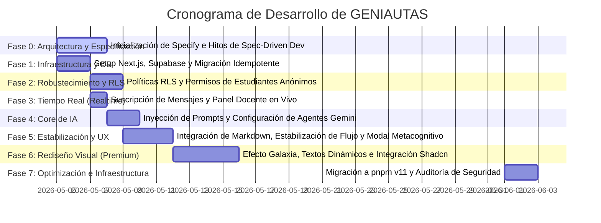

# Bitácora Cronológica del Proyecto: GENIAUTAS
## Desarrollo del Laboratorio Virtual de Prompt Engineering para la Educación Básica

Este documento presenta el **Timeline** detallado del proceso de diseño e implementación del software **GENIAUTAS**. Está estructurado para servir como material de respaldo y explicación metodológica en la memoria de título, detallando cronológicamente qué se hizo, por qué se hizo, sus implicaciones técnicas/pedagógicas y su relación con otros procesos del proyecto.

---

---

## Detalle Cronológico de las Fases del Proyecto

### Fase 0: Inicialización y Arquitectura con Specify (Spec-Driven Development)
*   **Qué se hizo**: 
    Instalación y configuración del marco **Specify** (`speckit` versión `0.8.2`) en el directorio `.specify/`. Se crearon los archivos de especificación inicial (`MVP-SPEC.md`), el plan técnico (`PLAN.md`), el gestor de tareas (`TASKS.md`) y las especificaciones por características detalladas en `.specify/features/` (Gestión de Sesiones, Acceso Estudiante, Interacción del Chatbot, Reanudación de Sesión y Monitoreo Docente).
*   **Por qué se hizo**: 
    Para adoptar la metodología **Spec-Driven Development (Desarrollo Guiado por Especificaciones)**. En un proyecto de titulación que involucra interacciones de IA y un contexto escolar delicado, es fundamental delimitar el alcance técnico del MVP antes de escribir código. Esto garantiza que cada funcionalidad responda directamente a una necesidad pedagógica validada empíricamente en la fase de prototipado en papel.
*   **Implicaciones**:
    *   **Fuente de Verdad Única**: Toda modificación en los requerimientos o en el alcance debe reflejarse primero en las especificaciones antes de codificarse.
    *   **Escenarios de Aceptación Claros**: Se definieron pruebas en formato *Behavior-Driven Development* (Given-When-Then), permitiendo la verificación independiente de las historias de usuario de estudiantes y docentes.
    *   **Alineamiento del Copilot**: Provee el contexto contextualizado necesario para que los agentes de codificación de IA entiendan los límites y las reglas de diseño (como las restricciones presupuestarias y las de privacidad infantil).
*   **Relación con otros procesos**: 
    Actúa como el puente directo entre el **Doble Diamante** (específicamente la transición de la fase de *Definición* a la de *Desarrollo*) y la codificación del sistema. Traduce los dolores detectados en el taller físico "¡IA en mi Colegio!" (como el miedo a la distracción escolar o la pérdida de agencia del alumno) en restricciones duras de software (ej. inhabilitación del input si la sesión está en pausa).

---

### Fase 1: Setup del Entorno Next.js y Migración de Datos Idempotente
*   **Qué se hizo**: 
    Inicialización de la aplicación principal `geniautas-app/` utilizando **Next.js (App Router)** y **TypeScript**. Se instalaron dependencias core (`@supabase/supabase-js`, `@supabase/ssr`, `@google/generative-ai`) y se crearon las primeras migraciones SQL de base de datos (`20260505000000_initial_schema.sql` y `20260505000001_idempotent_schema_fixes.sql`).
*   **Por qué se hizo**: 
    Next.js App Router proporciona una estructura sólida para renderizar en servidor (SSR) y en cliente de manera eficiente, ideal para un panel administrativo docente pesado y una vista estudiantil liviana. Las migraciones idempotentes (que utilizan bloques `DO` y verificaciones `IF NOT EXISTS`) se implementaron para permitir ejecuciones repetidas y despliegues continuos sin romper la base de datos existente.
*   **Implicaciones**:
    *   **Arquitectura Monolítica Simplificada**: La lógica de API (controladores de IA y moderación) y la interfaz de usuario residen en el mismo repositorio, reduciendo los costos de infraestructura (Free Tier friendly).
    *   **Modelamiento de Datos Base**: Se definieron tablas estructurales como `profiles` (docentes), `sessions` (clases virtuales), `roadmap_tasks` (actividades pedagógicas) y `schools` (colegios piloto).
*   **Relación con otros procesos**: 
    Establece la base física sobre la cual correrán todas las fases posteriores. La estructura de carpetas (`(student)/`, `(teacher)/`, `(auth)/`) segmenta el acceso por roles desde el inicio, alineándose con el plan de diseño del sistema.

---

### Fase 2: Seguridad, Privacidad Infantil y Robustecimiento de RLS
*   **Qué se hizo**: 
    Creación e implementación de migraciones de endurecimiento de base de datos (`20260507000000_rls_final_hardening.sql`, `20260507000001_fix_teacher_permissions.sql`, y `20260507000002_fix_student_permissions.sql`). Se configuraron políticas **RLS (Row-Level Security)** a nivel de tabla en Supabase y se otorgaron permisos explícitos de base de datos para los roles `anon` (estudiante) y `authenticated` (docente).
*   **Por qué se hizo**: 
    Por razones de **privacidad y seguridad infantil**, los estudiantes de educación básica deben poder ingresar a la aplicación sin necesidad de registrarse con un correo electrónico o contraseña (evitando la recopilación innecesaria de datos personales). Esto requiere que los estudiantes actúen bajo el rol anónimo (`anon`) de Supabase. Para que este esquema sea seguro, se debió programar políticas RLS estrictas en Postgres que impidan que un alumno anónimo lea el chat de otro estudiante o altere sesiones que no le corresponden.
*   **Implicaciones**:
    *   **Aislamiento de Datos por Token Temporal**: Los estudiantes son identificados por un ID de sesión temporal (`student_session_id`) guardado en su navegador. La base de datos valida esta clave contra las políticas RLS en cada consulta.
    *   **Acceso Seguro del Docente**: El docente autenticado solo puede leer y modificar las sesiones asociadas a su `profile_id`.
*   **Relación con otros procesos**: 
    Hace técnicamente viable la **User Story 2 (Acceso Estudiante sin Cuenta)**. Sin estas políticas de seguridad, el uso de cuentas anónimas habría vulnerado los estándares éticos y legales de desarrollo de software para menores de edad.

---

### Fase 3: Sincronización en Tiempo Real (Supabase Realtime)
*   **Qué se hizo**: 
    Habilitación de las tablas de mensajería (`messages`), progreso de tareas (`student_task_progress`), solicitudes de acceso (`access_requests`) y alertas (`alerts`) en la publicación en tiempo real de Supabase (`20260507000003_enable_realtime_all.sql`). Se conectaron los clientes web a los canales de suscripción.
*   **Por qué se hizo**: 
    En la dinámica de una sala de clases, el docente no puede depender de recargar la página web constantemente para ver si un estudiante ha completado una tarea, si ha enviado un mensaje inapropiado, o si está solicitando ingresar a la clase virtual. Necesita una visualización del estado del aula en vivo.
*   **Implicaciones**:
    *   **Monitoreo con Latencia < 2 Segundos**: El panel docente (`Teacher Live Monitor`) actualiza el estado de avance de los estudiantes instantáneamente tras cada interacción.
    *   **Sala de Espera Interactiva**: Los estudiantes son retenidos en una pantalla de espera y acceden de manera automática cuando el docente presiona "Aprobar" desde su dashboard.
*   **Relación con otros procesos**: 
    Une la experiencia física del aula con el software. Permite al docente actuar como mediador en tiempo real, detectando alumnos rezagados o bloqueados cognitivamente según el comportamiento reflejado en su pantalla.

---

### Fase 4: Core de IA y Modelado de Agentes Pedagógicos (Gemini API Proxy)
*   **Qué se hizo**: 
    Implementación del proxy de IA (`src/app/api/chat/route.ts`) e inyección dinámica de los System Prompts en `src/lib/ai/prompts.ts`. Se configuraron los roles específicos para los agentes pedagógicos del proyecto:
    1.  **CONSTRUBOT (Constructivista/Socrático)**: Nunca da la respuesta, realiza preguntas reflexivas y valida el proceso.
    2.  **PENSABOT (Cognitivista/Planificación)**: Divide problemas complejos en sub-pasos y fomenta la creación de hojas de ruta estructuradas.
    3.  **NEUTRO (Asistente General)**: Respuestas directas, concisas y amigables.
*   **Por qué se hizo**: 
    Para abordar la problemática central de la memoria de título: cómo evitar que los niños caigan en la "Amnesia de Agencia" (copiar y pegar sin pensar). En lugar de proveer una interfaz de chat estándar (estilo ChatGPT), el sistema debe andamiar el proceso cognitivo del estudiante a través del comportamiento diferenciado de los chatbots de IA.
*   **Implicaciones**:
    *   **Inyección Dinámica**: El prompt del sistema se autogenera combinando la personalidad del agente seleccionado, el objetivo pedagógico de la sesión y el listado de tareas (roadmap) parametrizado por el docente.
    *   **Moderación en Dos Capas**: Se implementó un filtro local previo (lista negra de conceptos) y políticas de seguridad integradas en la llamada de Gemini API para evitar la generación de contenidos inapropiados.
*   **Relación con otros procesos**: 
    Es el motor de aprendizaje de la aplicación. Convierte una simple ventana de chat en un recurso pedagógico estructurado bajo teorías del aprendizaje constructivistas y cognitivistas.

---

### Fase 5: Estabilización de Flujos, Integración de Markdown y Modales Metacognitivos
*   **Qué se hizo**: 
    Refactorización del flujo de reingreso estudiantil (`f48dd38`), agregando compatibilidad con componentes Markdown en las respuestas de la IA. Implementación del componente `ReflectionModal.tsx` que se despliega cuando un estudiante marca una tarea del roadmap como "Completada".
*   **Por qué se hizo**: 
    Las respuestas del modelo de lenguaje Gemini a menudo contienen listas numeradas, bloques de código (prompts estructurados) o textos formateados que requieren renderizarse en Markdown para no perder legibilidad. Por otro lado, la literatura educativa indica que el aprendizaje autónomo se consolida mediante la metacognición; el modal obliga al estudiante a responder una breve pregunta reflexiva antes de dar por cerrada una tarea.
*   **Implicaciones**:
    *   **Persistencia ante Caídas**: Si un estudiante se desconecta físicamente en el aula o refresca el navegador por error, el sistema recupera automáticamente su historial de chat y estado del roadmap mediante tokens en `sessionStorage` vinculados a la base de datos.
    *   **Reflexión pedagógica activa**: El roadmap pasa de ser una lista de verificación pasiva a una herramienta de autoevaluación.
*   **Relación con otros procesos**: 
    Estabiliza la robustez de la aplicación en condiciones reales de conectividad de aula (redes escolares que suelen ser inestables) y añade la capa práctica de evaluación metacognitiva.

---

### Fase 6: Rediseño Visual de Alta Fidelidad (Experiencia Espacial Premium)
*   **Qué se hizo**: 
    Modernización integral de la interfaz de usuario (`85b8d2a`) para alinearla con las directrices visuales del **GENIAUTAS Design System** (`GENIAUTAS-DESIGN.md`). Se implementaron:
    *   Fondo espacial dinámico interactivo en canvas (`Galaxy.tsx`).
    *   Efectos visuales premium de degradados animados y tipografía rotativa (`GradientText.tsx`, `RotatingText.tsx`).
    *   Primitivas de interfaz pulidas mediante bordes estelares interactivos (`StarBorder.tsx`).
    *   Integración y estilización de componentes base de Shadcn.
*   **Por qué se hizo**: 
    Para lograr una experiencia interactiva que "asombre" a niños de 10 a 12 años, fomentando su motivación intrínseca. Se adoptó una metáfora de **misión de exploración espacial** (Mission Night, Aurora Cyan, Mission Gold) que se siente lúdica y moderna, pero sin convertirse en un juego trivial, manteniendo un diseño limpio para no sobrecargar cognitivamente al estudiante durante el chat.
*   **Implicaciones**:
    *   **Identidad Visual Coherente**: Uso sistemático de variables CSS personalizadas (tokens de color, tipografía Fredoka/DM Sans, radios de curvatura suaves).
    *   **Atracción del Usuario**: La landing page inicial genera una primera impresión impactante ("wow factor") que introduce al alumno al rol de un "geniauta" en misión espacial.
*   **Relación con otros procesos**: 
    Materializa la propuesta de diseño estético del producto. Facilita la adopción del software por parte del estudiante escolar al conectar la usabilidad con una narrativa visual atractiva.

---

### Fase 7: Optimización de Dependencias e Infraestructura de Ingeniería (PNPM v11)
*   **Qué se hizo**: 
    Migración del gestor de paquetes de `npm` a **pnpm v11** (`967908d`), optimizando la resolución de dependencias, reduciendo el tamaño del directorio de almacenamiento (`node_modules`) y corrigiendo alertas críticas de seguridad en librerías secundarias.
*   **Por qué se hizo**: 
    Para garantizar que la aplicación esté construida sobre estándares de producción modernos y seguros. `pnpm` utiliza un almacenamiento direccionable por contenido global que agiliza el despliegue automático de la aplicación Next.js y previene problemas de "dependencias fantasmas" en tiempo de build.
*   **Implicaciones**:
    *   **Compilaciones más rápidas y limpias**: El tiempo de despliegue en entornos cloud disminuye sustancialmente.
    *   **Seguridad del Entorno**: Eliminación de vulnerabilidades reportadas en las librerías del ecosistema de React/Next.js.
*   **Relación con otros procesos**: 
    Prepara al software para la fase de producción, pruebas de carga y el despliegue final en la nube (ej. Vercel) para que pueda ser testeado masivamente en los colegios piloto del proyecto de título.

---

## Tabla Resumen de Relaciones y Flujos de Información

La siguiente tabla sintetiza cómo interactúan los componentes técnicos desarrollados en la línea de tiempo con los requerimientos y roles del sistema:

| Componente Técnico | Origen / Fase | Implicación en el Aula | Relación con otros Procesos |
| :--- | :--- | :--- | :--- |
| **Arquitectura Specify** | Fase 0 | Define los límites del software y los escenarios de prueba del MVP. | Vincula la investigación cualitativa inicial con la especificación de requerimientos de software. |
| **Postgres RLS Policies** | Fase 2 | Permite el ingreso rápido sin registros permanentes y resguarda la privacidad de datos. | Hace viable la User Story de Acceso Estudiante respetando normas éticas escolares. |
| **Supabase Realtime Sync** | Fase 3 | Muestra en vivo mensajes, progreso y alertas en la pantalla del docente. | Facilita la mediación docente y la gestión de la sala de clases. |
| **System Prompts Inyectados** | Fase 4 | Fuerza a la IA a actuar como andamio pedagógico según el tipo de agente. | Aplica teorías de aprendizaje constructivista y cognitivista en la conversación diaria. |
| **Reflection Modal** | Fase 5 | Despliega preguntas de autoevaluación al completar hitos del roadmap. | Cierra el ciclo metacognitivo del alumno sobre su propio proceso de Prompt Engineering. |
| **Galaxy UI Component** | Fase 6 | Sumerge al niño en una narrativa visual espacial de "misión científica". | Incrementa la motivación intrínseca y la retención del estudiante dentro de la plataforma. |
| **pnpm v11 Migration** | Fase 7 | Optimiza recursos y subsana vulnerabilidades de seguridad de la infraestructura. | Asegura la estabilidad técnica en la etapa de testing escolar en vivo. |
